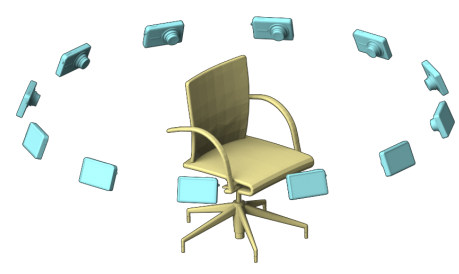

# sketchShape
This code implements the tasks for sketch-based 3D shape trieval

## Method
The methods are divided into sevaral steps:
* **Multiview renderding**. The shape are rendered on 12 different views. 
* **Finetune**.  The sketches and rendered shape images are finetuned with **AlexNet** as single image classification task. The finetuned features for both shrec13 and shrec14 could be downloaded as follows:
    ```
    chmod +x download.sh
    ./download.sh
    ```
* The shape features passed through a linear combination to form one global representation. Contrastive loss are employed for both within-domain pair and across-domain pair. 

## Training
change file mode
```
chmod u+x train.sh
```
### Training on shrec13
```
./train.sh 0 shrec13
```

### Training on shrec14
```
./train.sh 0 shrec14
```
